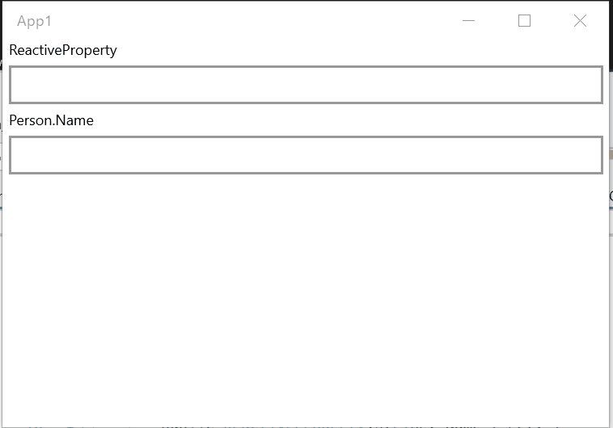
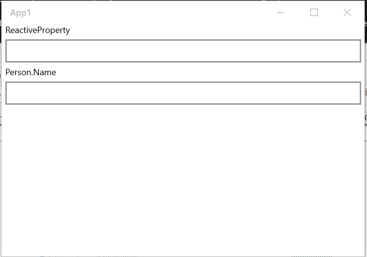

The classes of this library can work together with POCO classes.

## Connect to classes that implement INotifyPropertyChanged

ReactiveProperty provides many features that synchronize to POCO class instance.

### One-way synchronization

ToObserveProperty extension method of INotifyPropertyChanged interface convert INotifyPropertyChanged to IObservable&lt;T&gt;.
IObservable can convert to ReactiveProperty. It means that can be one-way synchronization to ReactiveProperty from INotifyPropertyChanged.

For example, below class is.

```cs
public class BindableBase : INotifyPropertyChanged
{
    public event PropertyChangedEventHandler PropertyChanged;

    protected void RaisePropertyChanged([CallerMemberName]string propertyName = null) =>
        PropertyChanged?.Invoke(this, new PropertyChangedEventArgs(propertyName));

    protected void SetProperty<T>(ref T field, T value, [CallerMemberName]string propertyName = null)
    {
        if (Comparer<T>.Default.Compare(field, value) == 0)
        {
            return;
        }

        field = value;
        RaisePropertyChanged(propertyName);
    }
}

public class Person : BindableBase
{
    private string _name;
    public string Name
    {
        get { return _name; }
        set { SetProperty(ref _name, value); }
    }

    private int _age;
    public int Age
    {
        get { return _age; }
        set { SetProperty(ref _age, value); }
    }
}
```

One-way synchronization is the following code.

```cs
// using Reactive.Bindings.Extensions;
public class ViewModel
{
    private Person Person { get; } = new Person();

    public ReadOnlyReactiveProperty<string> Name { get; }

    public ReactiveCommand UpdatePersonCommand { get; }

    public ViewModel()
    {
        Name = Person
            // Convert the Name PropertyChanged event to IObservable<string>
            .ObserveProperty(x => x.Name)
            // Convert to ReadOnlyReactiveProperty<string>
            .ToReadOnlyReactiveProperty();

        UpdatePersonCommand = new ReactiveCommand()
            .WithSubscribe(() =>
            {
                // Update the name property.
                Person.Name = "Tanaka";
            });
    }
}
```

### Two-way synchronization

ToReactivePropertyAsSynchronized extension method provides two-way synchronization.

```cs
// using Reactive.Bindings.Extensions;
public class ViewModel
{
    public Person Person { get; } = new Person();

    public ReactiveProperty<string> Name { get; }

    public ViewModel()
    {
        Name = Person.ToReactivePropertyAsSynchronized(x => x.Name);
    }
}
```

UWP platfrom example is below.

MainPage.xaml.cs

```cs
public sealed partial class MainPage : Page
{
    private ViewModel ViewModel { get; } = new ViewModel();
    public MainPage()
    {
        this.InitializeComponent();
    }
}
```

MainPage.xaml

```xml
<Page x:Class="App1.MainPage"
      xmlns="http://schemas.microsoft.com/winfx/2006/xaml/presentation"
      xmlns:x="http://schemas.microsoft.com/winfx/2006/xaml"
      xmlns:local="using:App1"
      xmlns:d="http://schemas.microsoft.com/expression/blend/2008"
      xmlns:mc="http://schemas.openxmlformats.org/markup-compatibility/2006"
      mc:Ignorable="d">
    <StackPanel Background="{ThemeResource ApplicationPageBackgroundThemeBrush}">
        <TextBlock Text="ReactiveProperty"
                   Style="{ThemeResource CaptionTextBlockStyle}"
                   Margin="5,0" />
        <TextBox Text="{x:Bind ViewModel.Name.Value, Mode=TwoWay, UpdateSourceTrigger=PropertyChanged}"
                 Margin="5" />
        <TextBlock Text="Person.Name"
                   Style="{ThemeResource CaptionTextBlockStyle}"
                   Margin="5,0" />
        <TextBox Text="{x:Bind ViewModel.Person.Name, Mode=TwoWay, UpdateSourceTrigger=PropertyChanged}"
                 Margin="5" />
    </StackPanel>
</Page>
```


ToSynchronizedReactiveProperty extension method can add convert logic and convert-back logic.

```cs
public class ViewModel
{
    public Person Person { get; } = new Person();

    public ReactiveProperty<string> Name { get; }

    public ViewModel()
    {
        Name = Person.ToReactivePropertyAsSynchronized(x => x.Name,
            convert: x => string.IsNullOrWhiteSpace(x) ? "" : $"{x}-san",
            convertBack: x => Regex.Replace(x, "-san$", ""));
    }
}
```



When an ignoreValidationErrorValue argument set to true, then stop the synchronization if validation error occurred.

```cs
public class ViewModel
{
    public Person Person { get; } = new Person();

    [StringLength(10)]
    public ReactiveProperty<string> Name { get; }

    public ViewModel()
    {
        Name = Person.ToReactivePropertyAsSynchronized(x => x.Name,
            convert: x => string.IsNullOrWhiteSpace(x) ? "" : $"{x}-san",
            convertBack: x => Regex.Replace(x, "-san$", ""),
            ignoreValidationErrorValue: true)  // activate this behavior
            .SetValidateAttribute(() => Name); // set validation logic
    }
}
```



### One-time synchronization

The FromObject method creates a ReactiveProperty instance from POCO.
This method set Value property from POCO when the ReactiveProperty instance created.

```cs
using Reactive.Bindings;
using System;

namespace ReactivePropertyEduApp
{
    class Sample
    {
        public string Property1 { get; set; }
    }
    class Program
    {
        static void Main(string[] args)
        {
            var sample = new Sample { Property1 = "xxx" };

            var rp = ReactiveProperty.FromObject(sample, x => x.Property1);
            Console.WriteLine(rp.Value); // -> xxx
            sample.Property1 = "updated";
            Console.WriteLine(rp.Value); // -> xxx
        }
    }
}
```

